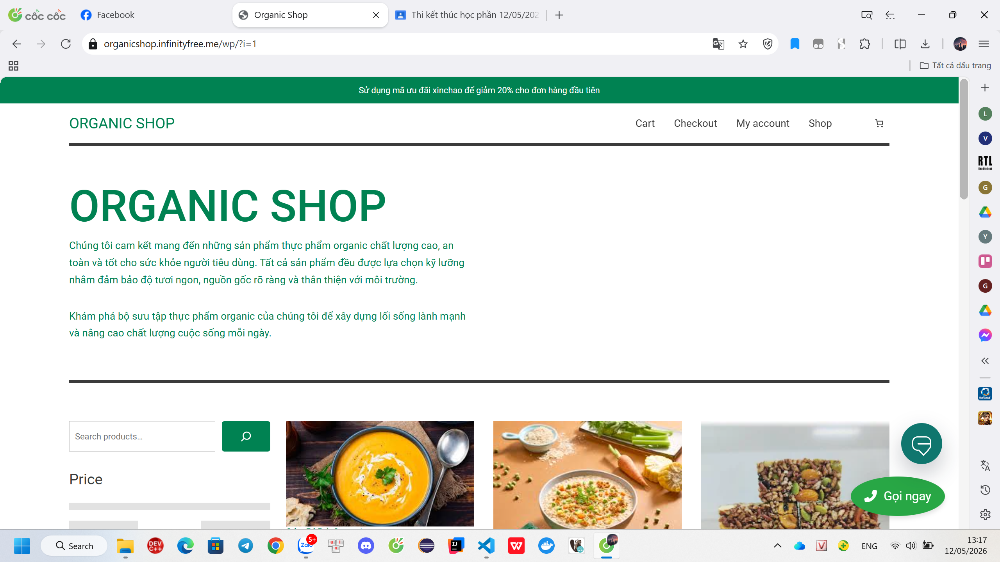
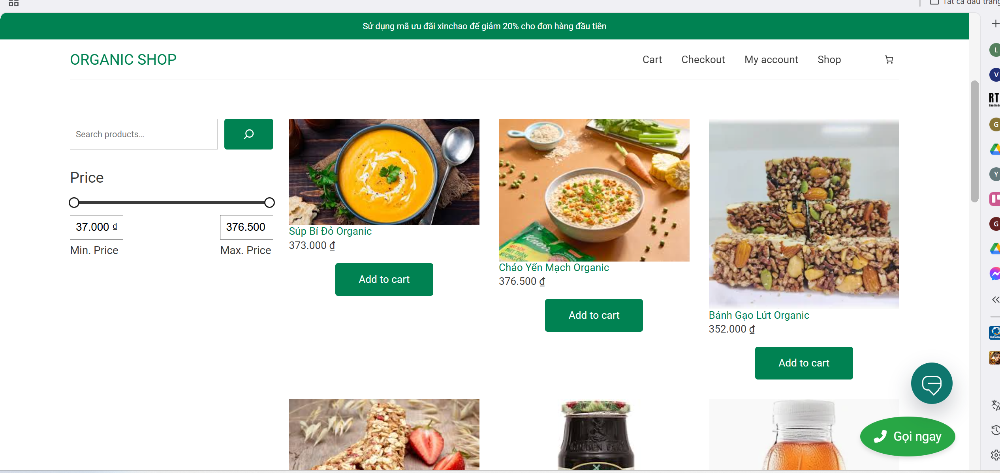
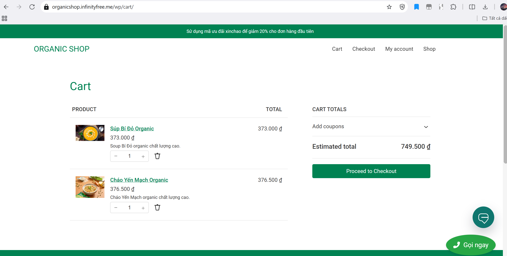
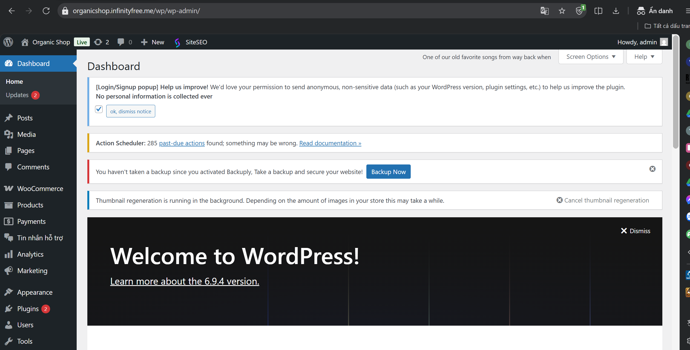

# README - WordPress Organic Shop

## 1. Tên đề tài
**Xây dựng website bán hàng Organic Shop bằng WordPress**

## 2. Giới thiệu website/hệ thống
Dự án xây dựng website thương mại điện tử Organic Shop trên nền tảng WordPress, tập trung vào bán sản phẩm hữu cơ trực tuyến.

Hệ thống hỗ trợ:
- Quản lý sản phẩm và danh mục sản phẩm.
- Quy trình mua hàng với giỏ hàng và thanh toán.
- Đăng nhập/đăng ký người dùng.
- Tích hợp nhiều plugin phục vụ vận hành cửa hàng, thanh toán, chat hỗ trợ và marketing.

## 3. Danh sách thành viên
- Nguyễn Đức Minh
- Vũ Minh Thành
- Ngô Đức Dũng

## 4. MSSV từng thành viên
- Nguyễn Đức Minh - MSV: 23810310259
- Vũ Minh Thành - MSV: 23810310236
- Ngô Đức Dũng - MSV: 23810310264

## 5. Phân công nhiệm vụ cụ thể
Phân công dựa trên các thành phần chính trong `wp-content/plugins`, chia đều khối lượng cho 3 thành viên.

### Thành viên 1: Nguyễn Đức Minh
- Quản lý và tích hợp plugin `akismet`.
- Quản lý và tích hợp plugin `easy-login-woocommerce`.
- Quản lý và tích hợp plugin `force-login-home-only`.
- Quản lý và tích hợp plugin `google-listings-and-ads`.
- Quản lý và tích hợp plugin `jetpack`.
- Quản lý và tích hợp plugin `merchant`.

### Thành viên 2: Vũ Minh Thành
- Quản lý và tích hợp plugin `momo-sandbox-for-woocommerce`.
- Quản lý và tích hợp plugin `php`.
- Quản lý và tích hợp plugin `pinterest-for-woocommerce`.
- Quản lý và tích hợp plugin `quick-call-button`.
- Quản lý và tích hợp plugin `reddit-for-woocommerce`.
- Quản lý và tích hợp plugin `snapchat-for-woocommerce`.

### Thành viên 3: Ngô Đức Dũng
- Quản lý và tích hợp plugin `vietqr`.
- Quản lý và tích hợp plugin `woo-chat-support`.
- Quản lý và tích hợp plugin `woocommerce`.
- Quản lý và tích hợp plugin `woocommerce-paypal-payments`.
- Quản lý file plugin `hello.php`.
- Quản lý file plugin `index.php`.

## 6. Công nghệ sử dụng
- WordPress (PHP)
- WooCommerce
- MySQL/MariaDB
- HTML/CSS/JavaScript
- Hệ sinh thái plugin WordPress trong `wp-content/plugins`

## 7. Hướng dẫn cài đặt
1. Cài đặt môi trường chạy PHP + MySQL (XAMPP/WAMP/Laragon).
2. Clone hoặc tải source code dự án về máy.
3. Đặt project vào thư mục web server (ví dụ: `htdocs` hoặc `www`).
4. Tạo database mới trong MySQL.
5. Import dữ liệu database (nếu có file `.sql`).
6. Cấu hình thông tin database trong file `wp-config.php`.

## 8. Hướng dẫn chạy project
1. Khởi động Apache/Nginx và MySQL.
2. Truy cập project bằng trình duyệt theo địa chỉ local (ví dụ: `http://localhost/wordpress_organic_shop`).
3. Đăng nhập trang quản trị WordPress tại `/wp-admin`.

## 9. Tài khoản demo (nếu có)
- Customer:
  - Username: 
  - Password: 
- Admin:
  - Username: 
  - Password: 

## 10. Hình ảnh minh họa hệ thống
Thư mục chứa hình ảnh: `img/`

Bạn thêm ảnh minh họa vào thư mục `img` và cập nhật vào README theo mẫu:

```markdown




```

## 11. Link video demo
- 

## 12. Link online đã deploy (nếu có)
- organicshop.infinityfree.me
